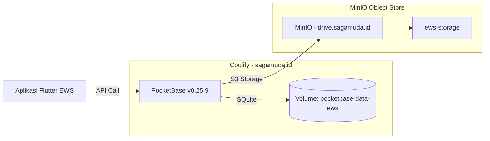

# 🚀 Panduan Deploy PocketBase EWS Semeru (Berdasarkan SOP Sagamuda)

> **Sumber**: Modifikasi dari `#Journal - PocketBase - BEST v0,25.docx` dan panduan Seagma
> **Versi Server**: PocketBase v0.25.9
> **Platform**: Coolify v4.0.0 di `sagamuda.id`
> **Prinsip**: 1 Project = 1 Container = 1 Subdomain Unik

---

## Filosofi (Dari Jurnal)

> *"Kita tidak menggunakan satu database raksasa. Kita menggunakan pendekatan **Isolated Backend**."*
> — Insan, Full Stack Vibe Coder

| Aturan | Contoh |
|---|---|
| Naming Convention | Prefix `db-[kode]` atau `pb-[kode]` |
| **EWS Semeru (Baru)** | **`db-ews.sagamuda.id`** |

---

## Step 1: Masuk ke Coolify

1. Buka browser → `https://sagamuda.id`
2. Login ke Coolify
3. Pilih Project **sgmd** → Environment **production** (atau environment yang sesuai)
4. Pastikan **Service Name** di Coolify diubah menjadi `db-ews` agar mudah diidentifikasi.

---

## Step 2: Buat Resource Baru (Docker Compose)

1. Klik tombol **+ New**
2. Pilih **Docker Compose** (BUKAN Docker Image)
3. Paste kode **"The Golden Docker Compose"** berikut:

```yaml
services:
  pocketbase:
    # Image Stabil & Modern (Kompatibel dengan SDK v0.26)
    image: ghcr.io/muchobien/pocketbase:0.25.9

    # EWS: Nama Container (Harus Unik)
    container_name: pocketbase-ews

    # Environment Variables
    environment:
      - SERVICE_PORT=8080
      # Mencegah update otomatis ke v0.36 yang UI-nya berubah drastis
      - POCKETBASE_CHECK_FOR_UPDATES=false

    # Command standar
    command: --http=0.0.0.0:8080 --dir=/pb_data --publicDir=/pb_public

    # Expose Port (Penting untuk Traefik Proxy)
    expose:
      - "8080"

    volumes:
      # EWS: Volume Unik (JANGAN SAMA dengan project lain!)
      - pocketbase-data-ews:/pb_data
      - pocketbase-hooks-ews:/pb_hooks
```

> [!CAUTION]
> **Jangan ubah `image`!** Versi `0.25.9` adalah versi yang sudah di-approve dan di-test.
> **Jangan ubah `command`!** Format ini sudah standar SOP Sagamuda.

---

## Step 3: Konfigurasi di Coolify

Setelah paste Docker Compose, atur hal berikut di dashboard Coolify:

### A. Environment Variables
Di tab **Environment Variables**, tambahkan:

```
PORT = 8080
```

### B. General → Domain
Di tab **General**, set FQDN:

```
https://db-ews.sagamuda.id
```

### C. Deploy
Klik tombol **Deploy** dan tunggu hingga status berubah menjadi **hijau** ✅.

---

## Step 4: Buat Superuser (WAJIB!)

> [!IMPORTANT]
> Setelah container hidup, Anda **WAJIB** membuat akun Superuser.
> Tanpa ini, Anda tidak bisa masuk ke dashboard PocketBase.

### Cara 1: Via Terminal Coolify

1. Di halaman Service yang baru di-deploy, klik tab **Terminal**
2. Jalankan perintah berikut (ganti password sesuai kebutuhan):

```bash
pocketbase superuser upsert sagamuda.id@gmail.com Sagamuda585858
```

Anda juga bisa membuat superuser tambahan untuk admin EWS:
```bash
pocketbase superuser upsert admin@ews-semeru.id EwsSemeru2026!
```

*(Jika cara di atas gagal, coba gunakan `/pb/pocketbase` atau cari lokasi binary dengan `which pocketbase`)*

---

## Step 5: Login ke Dashboard PocketBase

1. Buka browser → `https://db-ews.sagamuda.id/_/`
2. Login dengan email dan password yang Anda set di Step 4.
3. Anda akan melihat dashboard PocketBase v0.25.9 yang masih kosong.

---

## Step 6: Konfigurasi S3 Storage (MinIO)

Agar file/foto disimpan di MinIO (bukan di disk server):

### A. Buat Bucket di MinIO
1. Buka `https://drive.sagamuda.id`
2. Login ke MinIO Console
3. Klik **Create Bucket**
4. Nama: **`ews-storage`**
5. Access: **Private** (default)

### B. Hubungkan ke PocketBase
1. Di dashboard PocketBase (`db-ews.sagamuda.id/_/`)
2. Buka **Settings** (ikon gear) → **Files storage**
3. Aktifkan **S3 compatible storage**
4. Isi:

| Field | Nilai |
|---|---|
| **Endpoint** | `https://drive.sagamuda.id` |
| **Bucket** | `ews-storage` |
| **Region** | `us-east-1` |
| **Access Key** | `bOMOyK57UEkYzVQu` |
| **Secret Key** | `3Kev40QBmLeb4OgspjxNmyv1Kufr7sDn` |
| **Force path style** | ✅ (Centang — wajib untuk MinIO) |

5. Klik **Save changes**

---

## Step 7: Setup Schema (Koleksi Database)

Untuk proyek `ews-semeru`, Anda harus membuat koleksi database baru di PocketBase (misal: koleksi `sensor_data` untuk mencatat log amplitudo/suhu). Anda dapat membuat tabelnya secara manual via UI PocketBase.

---

## Step 8: Verifikasi Deployment

Cek kesehatan server dengan mengakses endpoint berikut:

```
https://db-ews.sagamuda.id/api/health
```

Response yang diharapkan:
```json
{"code":200,"message":"API is healthy."}
```

---

## Step 9: Update `.env` di Aplikasi Flutter EWS

Pastikan file `.env` di aplikasi Flutter Anda membaca URL backend ini:

```env
POCKETBASE_URL=https://db-ews.sagamuda.id
```

---

## Ringkasan Infrastruktur EWS Semeru


